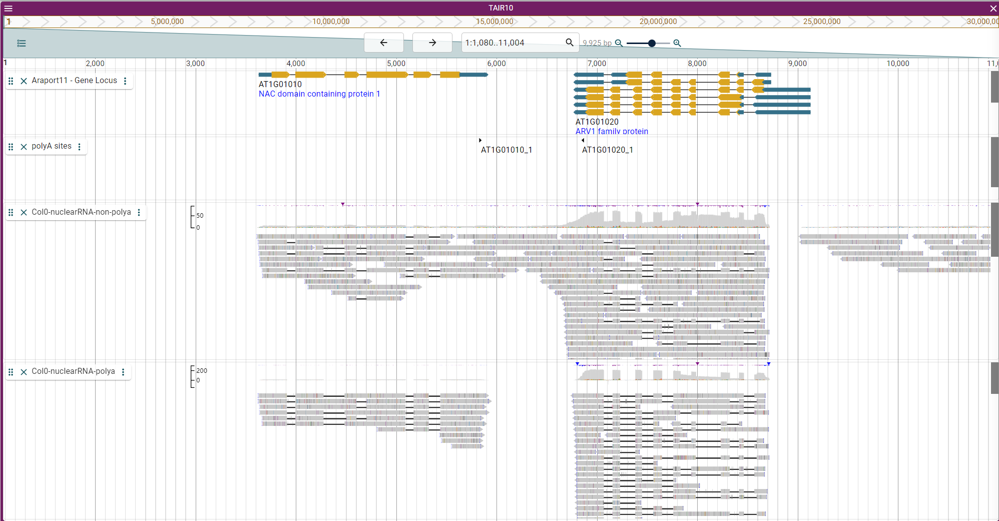

<!--
 * @Date         : 2021-08-20 09:58:31
 * @LastEditTime : 2021-08-20 10:27:54
 * @LastEditors  : windz
 * @FilePath     : /public/home/mowp/test/jbrowse-github/readme.md
-->

# Landscape of Transcription Termination in Arabidopsis Revealed by Single-molecule Nascent RNA Sequencing

## JBrowse link

We have created a [JBowse2 link](https://zhailab-sustech.github.io/jbrowse2/) for our sequenced reads.

## Data availability

Files are generously hosted by [CyVerse](https://cyverse.org/) and are available as straight-forward HTTP links. However, Cyverse is sometimes slow, and may result in error messages when some tracks that are meant to be shown.

| FileName | Link |
| --- | --- |
| Col0-nuclearRNA-non-polya | [BAM](https://data.cyverse.org/dav-anon/iplant/home/windz/termination/20210324_col_nuclear.elongating.bam) |
| Col0-nuclearRNA-polya | [BAM](https://data.cyverse.org/dav-anon/iplant/home/windz/termination/20210324_col_nuclear.polyadenylated.bam) |
| xrn3-nuclearRNA-non-polya | [BAM](https://data.cyverse.org/dav-anon/iplant/home/windz/termination/20210301_xrn3.elongating.bam) |
| xrn3-nuclearRNA-polya | [BAM](https://data.cyverse.org/dav-anon/iplant/home/windz/termination/20210301_xrn3.polyadenylated.bam) |

## Data reuse and license

We encourage the reuse of this data in your own analysis and publications which is released under the Creative Commons CC-BY license. Therefore we would be grateful if you would cite the reference below if you do.

